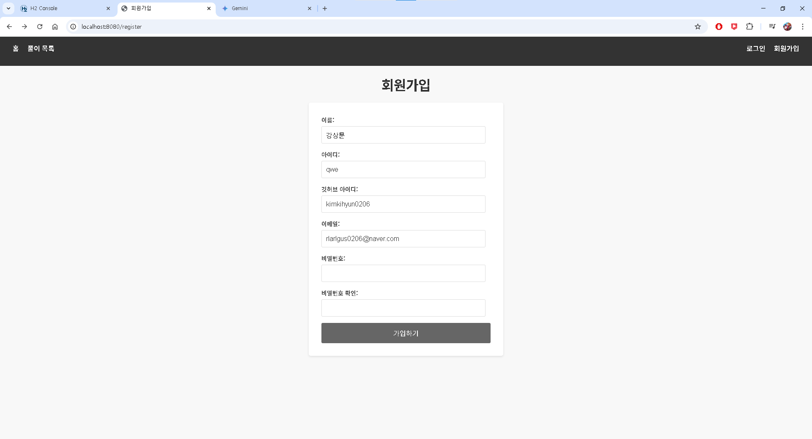

# 코딩 메이트 - 백준 답 모음 사이

## 소개
* 사용자가 작성한 풀이를 다른 사용자들과 공유하기 위해서 만들어진 사이트.
* 기존에 백준 문제를 풀다가 모르겠으면 구글에 `1234 자바`이런 방식으로 검색하여 풀이를 찾았다.
* 하지만 이는 번거롭고 내가 작성한 풀이를 veLog나 티스토리 같은 사이트에 저장해뒀을 때 찾기 힘들다.
* 이러한 문제를 해결하기 위해 내가 작성한 풀이를 문제 번호로 찾고, 남이 작성한 풀이를 간단하게 찾을 수 있는 사이트를 만들었다.
* 그리고 풀이 수에 따라 매일 랭킹을 갱신하여 적극적으로 풀이를 작성할 수 있도록 하였다.

## 기술 스택
### Backend
* Java 17
* Spring Boot 3.3.5
* Spring Security (JWT 인증)
* Spring Data JPA
* Querydsl
* Spring Batch
* Redis (캐싱 및 랭킹 저장소)
* MySQL 8.x (운영옹 RDBMS)

### DevOps / Infra
* Gradle
* Docker (로컬 개발용 Redis, DB)
* Oracle 서버

### API 문서
* SpringDoc OpenAPI 3 (Swagger UI)

 

# 아키텍처 개요 (Architecture)
본 프로젝트는 도메인 주도 설계(DDD) 기반으로 구성되어 있으며, 주요 컴포넌트는 다음과 같습니다.
* **API Layer**: REST Controller + Request/Response DTO
* **Service Layer**: 비즈니스 로직 처리, 트랜잭션 관리
* **Repository Layer**: JPA 및 Querydsl 기반 데이터 접근
* **Batch Job**: Spring Batch로 주기적인 랭킹 계산 및 Redis 반영
* **Redis**: 빠른 응답을 위한 랭킹 캐시 저장소
* **Security**: Spring Security + JWT 기반 인증 및 인가 처리

 

## 🧭 시스템 구성도

 

# 개발 파트

| 역할        | 이름      |
|:----------|:--------|
| 백앤드 개발자   | 김기현     |
| 프론트앤드 개발자 | 구글 제미나이 |

 

# 프론트앤드 구현

## 로그인되지 않은 뷰

### 홈

### 풀이 목록

### 풀이 조회

### 회원가입

### 로그인

## 로그인된 뷰

### 홈

### 풀이 등록

### 풀이 조회

### 풀이 수정

### 풀이 삭제

### 프로필

